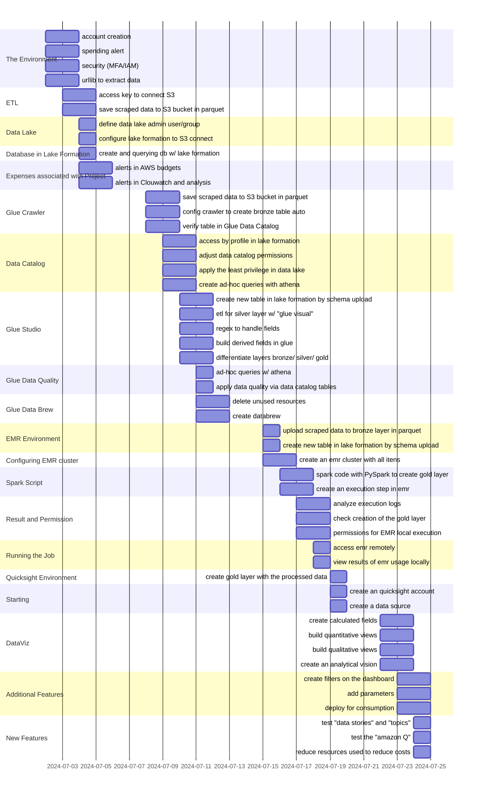
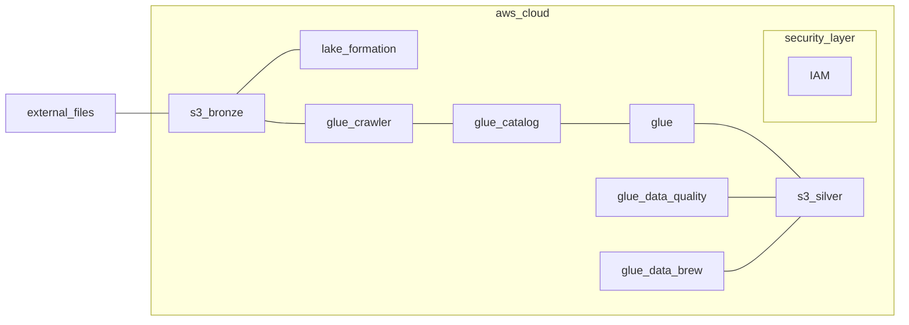

# Building Pipelines on AWS
> In this project I will build a Data Lake with a complete pipeline from external data ingestion, processing and ETL, to data analysis, dashboard construction and IaaC (Infrastructure as Code) using AWS services, Apache Spark and Python

<br>

## Solution Strategy



<br>

## Architecture


```External Files``` represents data scraped from the internet </br>
```Bucket S3 -> Bronze layer``` to store raw data </br>
```Lake Formation``` for Data Lake constructions with data centralization and better information management </br>
```Security Layer``` "IAM" service to create an auxiliary user that will insert Data into the Lake </br>

```Glue Crawler``` extract informations from ```Bucket S3``` and creation of table W/ ```Glue Catalog``` </br>
```Glue Catalog``` storing table informations </br>
```Glue``` ETL creation and information processing </br>
```Bucket S3 -> Silver layer``` to store processed data </br>
```Glue Data Quality``` quality of informations </br>
```Glue Data Brew``` processing services and ```Silver layer``` creation

<br>

## The Environment
## ETL
## Data Lake
## Database in Lake Formation
## Expenses associated with Project
## Glue Crawler
## Data Catalog
## AWS Connect | Create Bucket W/ Layers | Scapping | Transform to Parquet | Load to Bronze

```python
#%% [markdown]
## imports

#%%
import urllib.request
import pandas as pd
import boto3
from io import BytesIO

#%% [markdown]
## client config

#%%
def connect_to_s3():
    """
    Connect to AWS S3 using the default session/profile.
    
    Returns:
    boto3.client: Boto3 S3 client object.
    """
    return boto3.client("s3")

#%%
def create_bucket(bucket_name, region=None):
    """
    Function to create an S3 bucket.

    Parameters:
    bucket_name (str): Name of the S3 bucket.
    region (str, optional): AWS region name. Default is None.
    """
    s3_client = boto3.client('s3')
    try:
        if region is None:
            s3_client.create_bucket(Bucket=bucket_name)
        else:
            location = {'LocationConstraint': region}
            s3_client.create_bucket(Bucket=bucket_name, CreateBucketConfiguration=location)
        
        print(f"Bucket '{bucket_name}' successfully created.")
    except Exception as e:
        print(f"Error creating bucket: {e}")

#%%
def create_layers(bucket_name, s3_client):
    """
    Create the directory structure in the S3 bucket.

    Parameters:
    bucket_name (str): Name of the S3 bucket.
    s3_client (boto3.client): Boto3 S3 client object.
    """
    folders = ['bronze/', 'silver/', 'gold/']
    for folder in folders:
        try:
            s3_client.put_object(Bucket=bucket_name, Key=folder)
            print(f"Folder '{folder}' created in bucket '{bucket_name}'")
        except Exception as e:
            print(f"Error creating folder '{folder}' in bucket '{bucket_name}': {e}")

#%% [markdown]
## etl

#%%
def extract_to_parquet(url):
    """
    Download data from a URL, transform it to Parquet format, and return it as a buffer.

    Parameters:
    url (str): URL of the file to download.

    Returns:
    BytesIO: In-memory bytes buffer containing Parquet data.
    """
    try:
        with urllib.request.urlopen(url) as response:
            df = pd.read_csv(response)
            parquet_buffer = BytesIO()
            df.to_parquet(parquet_buffer, engine='pyarrow', index=False)
            parquet_buffer.seek(0)
            print(f"Download and transformation to Parquet completed for {url}")
            return parquet_buffer
    except Exception as e:
        print(f"Error in processing {url}: {e}")
        return None

#%%
def buffer_to_bucket(parquet_buffer, bucket_name, object_name, s3_client):
    """
    Upload Parquet buffer to AWS S3.

    Parameters:
    parquet_buffer (BytesIO): In-memory bytes buffer containing Parquet data.
    bucket_name (str): Name of the S3 bucket.
    object_name (str): Name of the object in S3.
    s3_client (boto3.client): Boto3 S3 client object.
    """
    try:
        s3_client.put_object(
            Bucket=bucket_name,
            Key=object_name,
            Body=parquet_buffer.getvalue(),
        )
        print(f"Upload to S3 completed for {object_name}")
    except Exception as e:
        print(f"Error uploading {object_name} to S3: {e}")

#%%
def load_to_bronze(files, bucket_name, s3_client):
    """
    Process each file in the list by downloading, transforming to Parquet, and uploading to S3.

    Parameters:
    files (list of tuples): List of tuples containing URLs and S3 object names.
    bucket_name (str): Name of the S3 bucket.
    s3_client (boto3.client): Boto3 S3 client object.
    """
    for url, object_name in files:
        parquet_buffer = extract_to_parquet(url)
        if parquet_buffer:
            # Upload to the "bronze" folder inside the bucket
            buffer_to_bucket(parquet_buffer, bucket_name, f"bronze/{object_name}", s3_client)

#%% [markdown]
## main

#%%
def main():
    """
    Main function to orchestrate the data extraction, transformation, 
    and uploading processes.
    """
    # S3
    s3_client = connect_to_s3()
    create_bucket(BUCKET_NAME, region_name)
    create_layers(BUCKET_NAME, s3_client)

    # transform and load
    load_to_bronze(FILES, BUCKET_NAME, s3_client)

if __name__ == "__main__":
    # constants
    BUCKET_NAME = "laranjao-datalakeaws"
    region_name = "us-east-1"
    FILES = [
    ("https://data.boston.gov/dataset/8048697b-ad64-4bfc-b090-ee00169f2323/resource/c9509ab4-6f6d-4b97-979a-0cf2a10c922b/download/311_service_requests_2015.csv", "data_2015.parquet"),
    ("https://data.boston.gov/dataset/8048697b-ad64-4bfc-b090-ee00169f2323/resource/b7ea6b1b-3ca4-4c5b-9713-6dc1db52379a/download/311_service_requests_2016.csv", "data_2016.parquet"),
    ("https://data.boston.gov/dataset/8048697b-ad64-4bfc-b090-ee00169f2323/resource/30022137-709d-465e-baae-ca155b51927d/download/311_service_requests_2017.csv", "data_2017.parquet"),
    ("https://data.boston.gov/dataset/8048697b-ad64-4bfc-b090-ee00169f2323/resource/2be28d90-3a90-4af1-a3f6-f28c1e25880a/download/311_service_requests_2018.csv", "data_2018.parquet"),
    ("https://data.boston.gov/dataset/8048697b-ad64-4bfc-b090-ee00169f2323/resource/ea2e4696-4a2d-429c-9807-d02eb92e0222/download/311_service_requests_2019.csv", "data_2019.parquet"),
    ("https://data.boston.gov/dataset/8048697b-ad64-4bfc-b090-ee00169f2323/resource/6ff6a6fd-3141-4440-a880-6f60a37fe789/download/script_105774672_20210108153400_combine.csv", "data_2020.parquet"),
    ]

    main()
```

<br>

## Public Access Block

```BASH
aws s3api put-public-access-block --bucket nome-do-seu-bucket --public-access-block-configuration BlockPublicAcls=true,IgnorePublicAcls=true,BlockPublicPolicy=true,RestrictPublicBuckets=true
```

<br>

## Data Catalog
#### Table Schema to Silver Layer

```JSON
[
    {"Name": "case_enquiry_id", "Type": "bigint"},
    {"Name": "open_dt", "Type": "timestamp"},
    {"Name": "target_dt", "Type": "timestamp"},
    {"Name": "closed_dt", "Type": "timestamp"},
    {"Name": "ontime", "Type": "string"},
    {"Name": "case_status", "Type": "string"},
    {"Name": "case_title", "Type": "string"},
    {"Name": "subject", "Type": "string"},
    {"Name": "reason", "Type": "string"},
    {"Name": "type", "Type": "string"},
    {"Name": "queue", "Type": "string"},
    {"Name": "department", "Type": "string"},
    {"Name": "submittedphoto", "Type": "string"},
    {"Name": "closedphoto", "Type": "string"},
    {"Name": "location", "Type": "string"},
    {"Name": "fire_district", "Type": "string"},
    {"Name": "pwd_district", "Type": "string"},
    {"Name": "city_council_district", "Type": "string"},
    {"Name": "police_district", "Type": "string"},
    {"Name": "neighborhood", "Type": "string"},
    {"Name": "neighborhood_services_district", "Type": "string"},
    {"Name": "ward", "Type": "string"},
    {"Name": "precinct", "Type": "string"},
    {"Name": "location_street_name", "Type": "string"},
    {"Name": "location_zipcode", "Type": "string"},
    {"Name": "latitude", "Type": "string"},
    {"Name": "longitude", "Type": "string"},
    {"Name": "source", "Type": "string"},
    {"Name": "closure_reason_normalized", "Type": "string"},
    {"Name": "duration_hours", "Type": "double"}
]
```

<br>

#### Regex used on Glue (Regular expression)
```Regex
^Case Closed\. Closed date : \d{4}-\d{2}-\d{2} \d{2}:\d{2}:\d{2}\.\d+ (.*)
```

<br>

#### duration
```SQL
select tb_1.*,
round(unix_timestamp(closed_dt)-unix_timestamp(open_dt))/3600,0) AS duration_hours
from tb_1
```

<br>


## Glue Studio
## Glue Data Quality
## Glue Data Brew

<br>

## EMR Environment
## Configuring EMR cluster
## Spark Script
## Result and Permission
## Running the Job

<br>

## Quicksight Environment
## Starting
## DataViz
## Additional Features
## New Features
