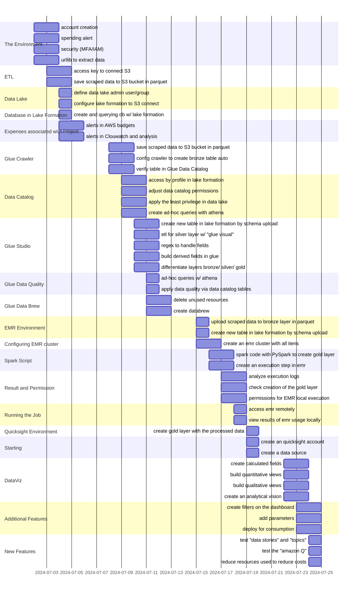
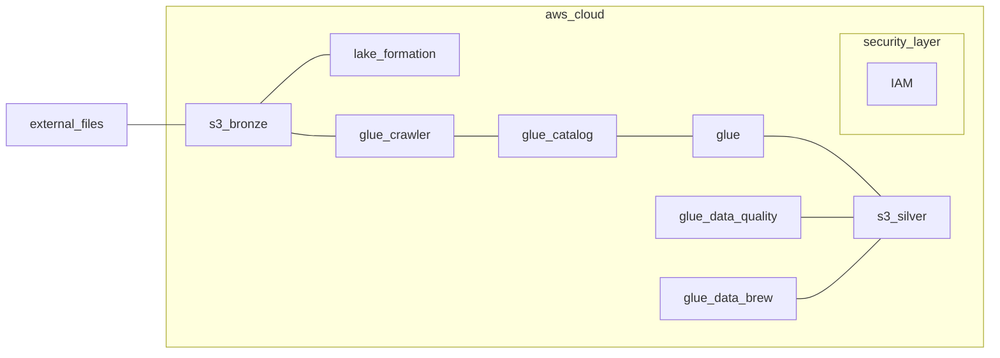

# Building Pipelines on AWS
> In this project I will build a Data Lake with a complete pipeline from external data ingestion, processing and ETL, to data analysis, dashboard construction and IaaC (Infrastructure as Code) using AWS services, Apache Spark and Python

<br>

## Solution Strategy



<br>

## Architecture


```External Files``` represents data scraped from the internet </br>
```Bucket S3 -> Bronze layer``` to store raw data </br>
```Lake Formation``` for Data Lake constructions with data centralization and better information management </br>
```Security Layer``` "IAM" service to create an auxiliary user that will insert Data into the Lake </br>

```Glue Crawler``` extract informations from ```Bucket S3``` and creation of table W/ ```Glue Catalog``` </br>
```Glue Catalog``` storing table informations </br>
```Glue``` ETL creation and information processing </br>
```Bucket S3 -> Silver layer``` to store processed data </br>
```Glue Data Quality``` quality of informations </br>
```Glue Data Brew``` processing services and ```Silver layer``` creation

<br>

## Data Scraping
```python
# %% [markdown]
## imports

# %%
import os
import urllib.request
import pandas as pd

# %% [markdown]
## constants

# %%
DATA_DIR = "../data"
FILES = [
    ("https://data.boston.gov/dataset/8048697b-ad64-4bfc-b090-ee00169f2323/resource/c9509ab4-6f6d-4b97-979a-0cf2a10c922b/download/311_service_requests_2015.csv", "dados_2015.csv"),
    ("https://data.boston.gov/dataset/8048697b-ad64-4bfc-b090-ee00169f2323/resource/b7ea6b1b-3ca4-4c5b-9713-6dc1db52379a/download/311_service_requests_2016.csv", "dados_2016.csv"),
    ("https://data.boston.gov/dataset/8048697b-ad64-4bfc-b090-ee00169f2323/resource/30022137-709d-465e-baae-ca155b51927d/download/311_service_requests_2017.csv", "dados_2017.csv"),
    ("https://data.boston.gov/dataset/8048697b-ad64-4bfc-b090-ee00169f2323/resource/2be28d90-3a90-4af1-a3f6-f28c1e25880a/download/311_service_requests_2018.csv", "dados_2018.csv"),
    ("https://data.boston.gov/dataset/8048697b-ad64-4bfc-b090-ee00169f2323/resource/ea2e4696-4a2d-429c-9807-d02eb92e0222/download/311_service_requests_2019.csv", "dados_2019.csv"),
    ("https://data.boston.gov/dataset/8048697b-ad64-4bfc-b090-ee00169f2323/resource/6ff6a6fd-3141-4440-a880-6f60a37fe789/download/script_105774672_20210108153400_combine.csv", "dados_2020.csv"),
]

# %% [markdown]
## etl

# %%
def create_data_dir(directory):
    """
    Create a directory if it does not exist.

    Parameters:
    directory (str): Path of the directory to be created.
    """
    os.makedirs(directory, exist_ok=True)

# %%
def extract_data(url, filename):
    """
    Download data from a URL and save it to a specified filename.

    Parameters:
    url (str): URL of the file to download.
    filename (str): Local path where the file will be saved.
    """
    try:
        urllib.request.urlretrieve(url, filename)
        print(f"scraping was done -> {filename}")
    except Exception as e:
        print(f"Houston, we have a problem in {filename}: {e}")

# %%
def load_data(files):
    """
    Load data from a list of files into a dictionary of DataFrames.

    Parameters:
    files (list of tuples): List of tuples containing URLs and filenames.

    Returns:
    dict: Dictionary where keys are years and values are DataFrames.
    """
    dfs = {}
    for url, filename in files:
        filepath = os.path.join(DATA_DIR, filename)
        extract_data(url, filepath)
        ano = filename.split("_")[-1].split(".")[0]
        dfs[ano] = pd.read_csv(filepath)
    return dfs

# %% [markdown]
## main

# %%
def main():
    """
    Main function to orchestrate the data extraction, loading, 
    and uploading processes.
    """
    # Create data directory
    create_data_dir(DATA_DIR)

    # Load data
    dfs = load_data(FILES)

    # Print 2018
    print(dfs["2018"].head(3))

if __name__ == "__main__":
    main()
```

<br>

| _id | case_enquiry_id | open_dt | sla_target_dt | closed_dt | on_time | case_status | closure_reason | case_title | subject | reason | type | queue | department | submitted_photo | closed_photo | location | fire_district | pwd_district | city_council_district | police_district | neighborhood | neighborhood_services_district | ward | precinct | location_street_name | location_zipcode | latitude | longitude | geom_4326 | source |
|--|--|--|--|--|--|--|--|--|--|--|--|--|--|--|--|--|--|--|--|--|--|--|--|--|--|--|--|--|--|--|
| 101002296861    | 2018-01-01 00:08:00 | NaN                 | 2018-03-01 15:18:12 | ONTIME | Closed      | Case Closed. Closed date : 2018-03-01 15:18:12... | Fire Hydrant         | Boston Water & Sewer Commission            | Fire Hydrant                  | ... | E13            | Jamaica Plain                    | 11                                | Ward 19 | 1903      | 413 Centre St        | 2130.0           | 42.3214  | -71.1109  | Constituent Call      |
| 101002296862    | 2018-01-01 00:09:46 | 2018-01-02 08:30:00 | 2018-01-02 21:15:22 | OVERDUE| Closed      | Case Closed. Closed date : 2018-01-02 21:15:22... | Parking Enforcement | Transportation - Traffic Division          | Enforcement & Abandoned Vehicles| ... | C6             | South Boston / South Boston Waterfront | 5                                | Ward 6  | 0604      | 428 W Second St      | 2127.0           | 42.3373  | -71.0445  | Citizens Connect App  |
| 101002296864    | 2018-01-01 00:11:24 | 2018-01-02 08:30:00 | 2018-01-02 21:15:11 | OVERDUE| Closed      | Case Closed. Closed date : 2018-01-02 21:15:11... | Parking Enforcement | Transportation - Traffic Division          | Enforcement & Abandoned Vehicles| ... | C6             | South Boston / South Boston Waterfront | 5                                | Ward 6  | 0604      | 401-403 W Second St  | 2127.0           | 42.3371  | -71.0442  | Citizens Connect App  |

> In this table we have information on how and when the request was opened, when it was closed, what the status is, the reason for this request and the corresponding grouping

<br>

## Connect to S3
```python
# %% [markdown]
## imports

# %%
import boto3

# %% [markdown]
## constants

# %%
BUCKET_NAME = "laranjao-datalakeaws"

# %% [markdown]
## S3

# %%
def connect_to_s3(aws_access_key_id, aws_secret_access_key, region_name):
    """
    Set up a session and connect to AWS S3.

    Parameters:
    aws_access_key_id (str): AWS access key ID.
    aws_secret_access_key (str): AWS secret access key.
    region_name (str): AWS region name.

    Returns:
    boto3.client: Boto3 S3 client object.
    """
    boto3.setup_default_session(
        aws_access_key_id=aws_access_key_id,
        aws_secret_access_key=aws_secret_access_key,
        region_name=region_name,
    )
    return boto3.client("s3")

# %% [markdown]
## main

# %%
def main():
    """
    Main function to orchestrate the data extraction, loading, 
    and uploading processes.
    """
    # Define AWS credentials
    aws_access_key_id = 🤔
    aws_secret_access_key = 🤐
    region_name = "us-east-2"

    # Create data directory
    create_data_dir(DATA_DIR)

    # Load data
    dfs = load_data(FILES)

    # Connect to S3
    s3_client = connect_to_s3(aws_access_key_id, aws_secret_access_key, region_name)

if __name__ == "__main__":
    main()
```

<br>

## Save to Parquet
```python
# %% [markdown]
## imports

# %%
from io import BytesIO

# %% [markdown]
## S3

# %%
def upload_to_s3(dfs, bucket_name, s3_client):
    """
    Upload DataFrames to AWS S3 as Parquet files.

    Parameters:
    dfs (dict): Dictionary where keys are years and values are DataFrames.
    bucket_name (str): Name of the S3 bucket.
    s3_client (boto3.client): Boto3 S3 client object.
    """
    for ano, df in dfs.items():
        parquet_buffer = BytesIO()
        df.to_parquet(parquet_buffer, engine='pyarrow')
        s3_client.put_object(
            Bucket=bucket_name,
            Key=f"bronze/dados_{ano}.parquet",
            Body=parquet_buffer.getvalue(),
        )
        print(f"dados_{ano}.parquet upload to S3")

# %%
def list_contents(bucket_name, s3_client):
    """
    List the contents of an S3 bucket.

    Parameters:
    bucket_name (str): Name of the S3 bucket.
    s3_client (boto3.client): Boto3 S3 client object.

    Returns:
    list: List of keys in the S3 bucket.
    """
    response = s3_client.list_objects(Bucket=bucket_name)
    keys = [obj["Key"] for obj in response.get("Contents", [])]
    print(keys)
    return keys

# %% [markdown]
## main

# %%
def main():
    """
    Main function to orchestrate the data extraction, loading, 
    and uploading processes.
    """
    # Define AWS credentials
    aws_access_key_id = 🤔
    aws_secret_access_key = 🤐
    region_name = "us-east-2"

    # Create data directory
    create_data_dir(DATA_DIR)

    # Load data
    dfs = load_data(FILES)

    # Connect to S3
    s3_client = connect_to_s3(aws_access_key_id, aws_secret_access_key, region_name)

    # Upload DataFrames to S3
    upload_to_s3(dfs, BUCKET_NAME, s3_client)

    # List S3 bucket contents
    list_contents(BUCKET_NAME, s3_client)

if __name__ == "__main__":
    main()
```

> ['bronze/', 'bronze/dados_2015.parquet', 'bronze/dados_2016.parquet', 'bronze/dados_2017.parquet', 'bronze/dados_2018.parquet', 'bronze/dados_2019.parquet', 'bronze/dados_2020.parquet', 'silver/']

<br>

## Glue Crawler
## Data Catalog
## Glue Studio
## Glue Data Quality
## Glue Data Brew

<br>

## EMR Environment
## Configuring EMR cluster
## Spark Script
## Result and Permission
## Running the Job

<br>

## Quicksight Environment
## Starting
## DataViz
## Additional Features
## New Features
